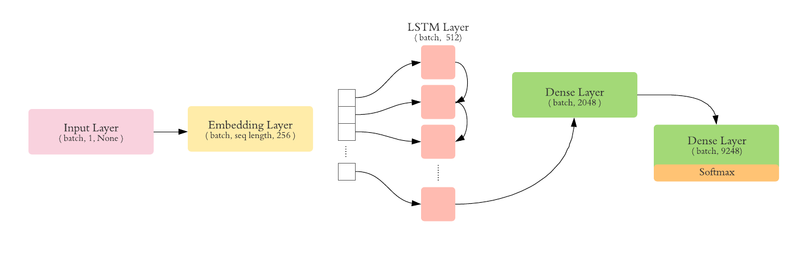
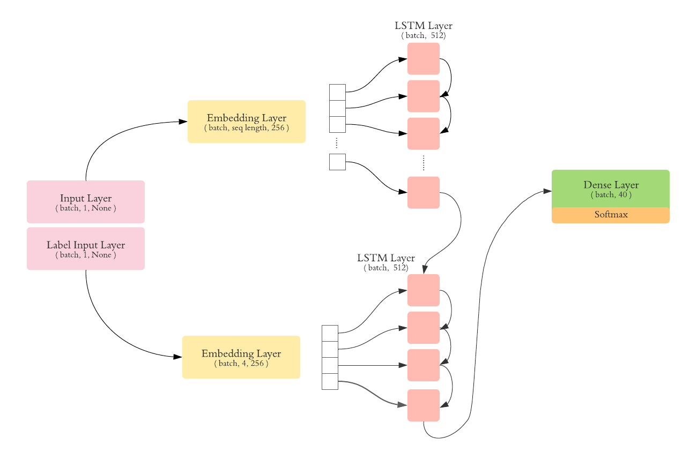
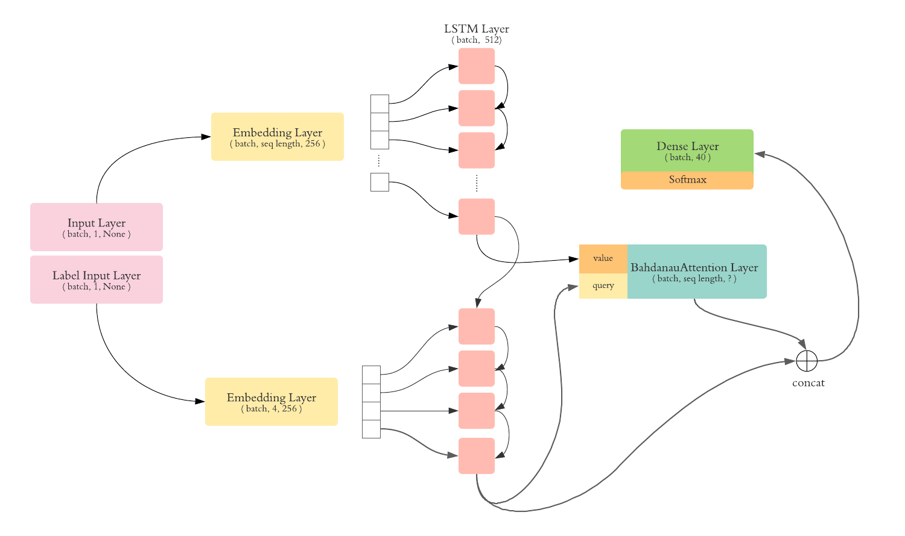
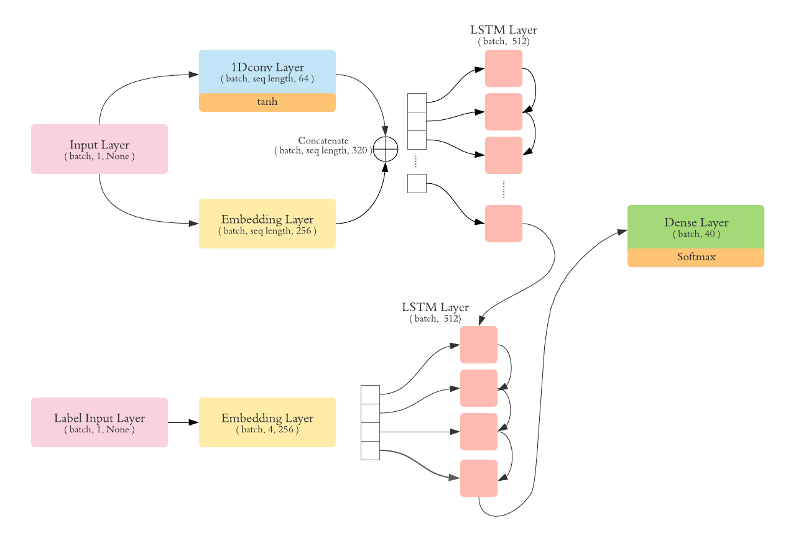

# disease description to cim-10 code

This repository contains multiple models where the goal is to translate sentences describing a disease to CIM-10 medical codes.

5 different models where trained for this purpose.

## cim-10 first char classification

The purpose of the model found in **first-char-classification** is to classify the first character of the cim-10 code. Our model has 26 labels. 
2 variants where used when computing a sentence embedding.

For the first variant, we used an embedding layer along with a global average pooling. On the second one, we computed the sentence embedding using an LSTM layer.

| model                         | training accuracy | validation accuracy
| -----------                   | -----------       |       -----       |
| classifier - average pooling  | 86,9%             |       81%         |
| classifier - LSTM             | 86,9%             |      80,5%        |

## How to evaluate models that predict the full code sequence

In order to evaluate our models, we developed 2 metrics. The first one consists of a substring accuracy, calculates the accuracy on substrings. 
In our case, we calculated the accuracy for the first character, the first two characters and the first three characters.

Since the order of the characters is important when it comes to cim-10 codes, we also used a weighted BLEU score as a second metric.

Metrics can be found in `utils/metrics`

## cim-10 code prediction

The following section describes the different models that were used to predict the cim-10 code.

### cim-10 code classification

In this task, the goal is to train a model in order to classify 9248 labels, that represent all the available cim-10 codes in our dataset.

The following architecture was used:

### seq2seq models

We trained different seq2seq models starting from vanilla seq2seq to attention. The architectures that we used are detailed below.

We chose an embedding size of 256, and a LSTM units size of 512. We trained the model on batches of 256.

#### 1 - vanilla seq2seq

Tha vanilla seq2seq is composed of an LSTM encoder and an LSTM decoder. The following architecture was used:

#### 2 - seq2seq with attention

In this model, we added an attention layer to our decoder.

#### 3 - seq2seq with attention

In this model, we added a 1D cnn layer that we apply on words. The cnn will capture how the word is composed of ( prefix, suffix ). We the concatenate the result of the convolution along with the embedding layer.
the result is pushed then to the LSTM encoder.

## model comparison

| model                         | one char accuracy | two char accuracy | three char accuracy
| -----------                   |       -----       |       -----       |       -----        |
| classifier                    |      78,4%        | 78,4%             |      74,5%         |
| vanilla seq2seq               |      91,3%        | 88,7%             |       85,7%        |
| attention seq2seq             |      92,8%        | 91%               |      88,9%         |
| cnn1D + seq2seq               |      96,8%        | 96,8%             |      96,1%         |

